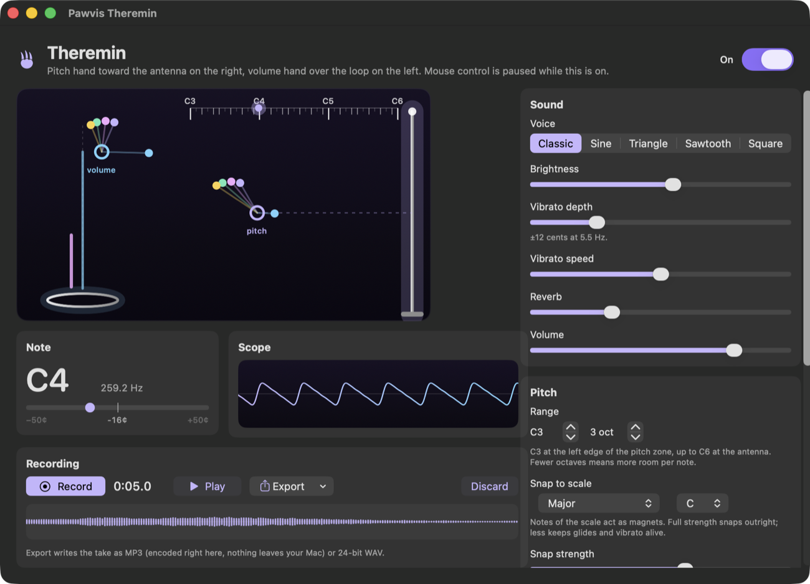
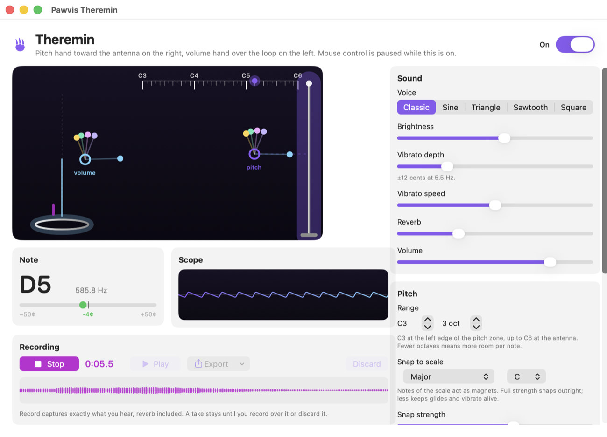

<h1 align="center">Pawvis</h1>

<p align="center"><a href="https://pawvis.app">pawvis.app</a></p>

<p align="center">
  
</p>

<p align="center"><em>Touch-free hand control for your Mac</em></p>

---

Pawvis turns your webcam into a pointing device that works from thin air.
Raise your open hand anywhere the camera can see it and the cursor follows;
dip a finger to click, hold it down to drag, fold two fingers to scroll.
Nothing under your palm, nothing to touch: your hand is the mouse. There's
also a [voice mode, in beta](#voice-control-beta): talk to your Mac by name
(*"Pawvis, open Safari"*), with the aim of growing into an
accessibility-grade voice control more intuitive and capable than the
built-in one. And there is a [theremin](#theremin): the same hand tracking
plays a real instrument, recorded and exported as MP3 without leaving your
Mac.

Hand tracking runs entirely on-device with Apple's Vision framework; speech
recognition is Apple's on-device engine; and free-form visual commands are
resolved by on-device Apple Intelligence. By default, nothing you do leaves
your Mac; the one exception is the opt-in agent hand-off below.

<p align="center">
  <a href="https://github.com/alexandriax/pawvis/releases/latest/download/Pawvis.zip"><strong>⬇&nbsp; Download Pawvis for macOS</strong></a>
  <br>
  <a href="https://github.com/alexandriax/pawvis/releases/latest"></a>
  <br>
  <sub>Signed and notarized · macOS 14+ · unzip and drag to Applications</sub>
</p>

[](https://youtu.be/xDQwwXdeuUs)

[Watch the demo film on YouTube](https://youtu.be/xDQwwXdeuUs)

> [!IMPORTANT]
> **Pawvis really does control your Mac.** It moves the cursor and posts real
> clicks, drags and scrolls, so an accidental finger dip is an accidental
> click, and a click lands on whatever is under the cursor at that moment
> (Send, Delete, Confirm). Treat it like handing someone else your mouse. Give
> it a few minutes somewhere harmless, like the Finder or a scratch document,
> until the gestures feel deliberate, and keep the menu bar toggle in reach:
> tracking stops the moment you switch it off, and the cursor parks whenever
> you close your hand or take it out of the camera's view. With voice control
> on, spoken commands do the same thing, and a misheard sentence is still a
> command. Pawvis is provided as is, without warranty of any kind: its
> developer accepts no liability for any action taken with it, intentional or
> not, or for any resulting loss or damage. Please use it responsibly.

## Gestures

Your hands are tracked whenever tracking is on, but the cursor only follows
once you **show an open hand**: all four fingers up, thumb free. Close it
into a fist for a moment, or take it out of view, to park the cursor again;
the claw fades while it's parked. That keeps a hand that's merely visible
(resting, typing, gesturing) from dragging the cursor around. **Settings →
Tracking** switches back to "Any detected hand" if you'd rather have no
trigger at all, or all the way to **"Never — custom gestures only"**, which
keeps the mouse untouched entirely: your hands become a remote that only
fires the gestures you've assigned.

Once you have it, your hand is the mouse: the cursor rides your palm, and your
fingers are the buttons. Everything below is tunable in **Settings →
Mouse**.

- **Move**: hold your hand open, fingers up, and move it.
- **Click**: dip your **index finger**, like tapping a mouse button.
  Measured against your middle finger, so tilting your whole hand can't
  click. A quick release is always a clean click.
- **Right-click**: dip a second finger (**pinky** by default, configurable).
  Hold it to right-drag.
- **Middle-click**: give a third finger the middle mouse button in Settings.
  Off by default.
- **Drag / hold**: keep the finger down and move. Deliberate movement starts
  a drag immediately; otherwise a short window protects quick clicks from
  turning into accidental drags. The window length is a slider.
- **Double / triple click**: tap again quickly in the same spot.
- **Dwell click** (optional, off by default): clicking without the finger
  dip. Park the cursor on a target and hold it still; after the dwell time
  (0.5 to 3 s, a slider) a left click fires at the settled spot, with the
  ring around the claw tightening as the countdown runs. Move the cursor
  away to arm the next one, so resting in place clicks once, never a
  stream, and it never fires while a button is held, while scrolling, or
  while the cursor is parked. Built for hands that can't manage a crisp
  finger dip. **Settings → Mouse** can also put the cursor on the index
  fingertip, thumb tip, or pinch midpoint instead of the palm; fingertip
  sources point more directly but wobble during finger clicks, so they
  pair best with dwell clicking, where clicking moves no fingers.
- **Scroll**: fold your **middle and ring fingers** in, index and pinky up,
  then move your hand up and down. The cursor parks while the pose is held.
  Settings has the toggle, a scroll speed slider, optional horizontal
  scrolling for sideways movement, and an invert switch (vertical only).
- **Stop tracking**: hold up **both hands** open with fingers spread wide, like
  a double high-five, then wave them across each other. Once they have traded
  sides twice (over and back), hand tracking switches off entirely, the same
  as the menu bar switch. Optional, on by default; the number of crossings is
  a setting under **Settings → Tracking**.
- **Custom gestures**: **Settings → Gestures** lists a library of extra
  one-shot gestures, every one of them visible and none of them live until
  you give it an action. Wiggle your fingers with a hand raised palm to the
  camera, or point a hand flat at the screen and drum on invisible keys (a
  separate gesture, and both come in one-hand and two-hand versions). Hold
  a fist with your thumb up, down, or tilted to point straight left or
  right, hold a shaka, or bunch all your fingertips onto your thumb and
  fling the bunch toward any edge or corner, eight directions in all. A
  gesture's action can be anything from the catalog: move between
  virtual desktops, open Mission Control or App Exposé, show the desktop,
  snap the focused window (halves, thirds, two-thirds, quarters, center,
  maximize, minimize, next display), press Return or Escape, go back or
  forward, switch tabs, play/pause, adjust volume or brightness, stop
  tracking, toggle voice control, open any app, press any keyboard shortcut,
  or run a shell command you provide (it runs exactly as typed, as you).
  Every gesture row carries its own collapsed **Tuning** section (hold time,
  wiggle vigor, grab tightness, fling distance), so a gesture that won't
  trigger, or triggers too easily, can be dialed in on the spot. Every
  binding can also carry **per-app actions**: add apps to a gesture's row
  and give each its own action, and whichever app is frontmost when the
  gesture fires decides which action runs (a thumbs up can advance slides
  in Keynote and press your merge shortcut in the browser). Leave the main
  action unassigned and the gesture fires only in the apps you listed. The
  pill at the top of the screen confirms every fire, and the Gesture Guide
  illustrates every gesture in full, with what it is currently set to do.
- **Train your own gestures**: **Settings → Gestures → Train New Gesture**
  opens a camera window with your hand's tracking drawn live, a color per
  fingertip and a ring on the palm. Pick one hand or two, perform your
  motion (or hold a pose) 3 to 10 times, and Pawvis learns a template from
  your takes, tells you when they agree well enough, and lets you try the
  match live before saving. Trained gestures join the Gestures tab with an
  animated badge that replays the learned motion, and they work like the
  built-ins: rename them, remove them, tune how strictly they match, and
  bind them to any action from the same catalog (or leave them unassigned);
  per-app actions work here too.
  Each one can also require a hold before it fires (the pill counts the
  hold down), and a priority switch decides who wins when a gesture looks
  like a click: by default trained gestures keep matching through clicks
  and scrolls, and a match in progress blocks new clicks. Pawvis control
  pauses while the trainer is open, so recording never fights the mouse.
  Training data never leaves this Mac, like all tracking.
- **Reach adapts to distance.** Auto mode sizes the tracking area from how big
  your hand looks, so the whole screen stays reachable up close *and* far away
  with your fingers staying inside the camera frame. Manual mode gives you a
  fixed area and a slider.

The on-screen claw is your cursor: open while pointing, retracted and purple
while the left button is held, blue for the right button, pink for the middle
button, ringed in light blue while scrolling, faded while control is parked,
with a ring that tightens as your click forms and a pulse confirming every
click. Small dots mark each detected fingertip.

The menu bar icon opens a live status panel (hands seen, whether control is
armed, voice-control state, the theremin, and a camera picker once more than
one camera is around) plus a **Gesture Guide** window that walks through every
gesture.

There is also a **practice round**: a two-minute game that teaches the basic
moves against live targets (take control, move, click, drag, scroll,
right-click), with the tracker's view of your hand beside the board so you can
see what it sees while you learn. A lesson only counts when the real click,
drag or scroll reaches the practice window, so it doubles as a check that
clicks actually land. It opens once after the welcome tour, every lesson is
skippable, and **Settings → About → Practice the moves** runs it again.

## Voice control (beta)

Off by default while in beta. Enable it in **Settings → Voice (Beta)**,
then press **Start** next to Voice control in the menu bar. Address Pawvis
by its **wake word** (default `Pawvis`, configurable; mishearings are
tolerated). Filler before it is fine too, like "Um, Pawvis, open Chrome",
and a garbled wake word still gets a second look from on-device Apple
Intelligence before Pawvis gives up on the command. **Every command starts
with the wake word**. Speech without it is ignored and never typed or
displayed. Commands are understood by a fast built-in grammar first, then
by on-device Apple Intelligence, and only genuinely visual requests drive
the screen step by step:

| Say | Pawvis does |
|---|---|
| "Pawvis, **go to** heresalexandria dot com" or "**open** discord dot com **in Chrome**" | Navigates there in the frontmost browser (via the address bar), or in a named app; falls back to your default browser, saying so, if you don't name one or it isn't found. Non-URL targets become a web search. |
| "Pawvis, **type** good morning" | Types exactly that text into the focused app. One-shot, no lingering dictation mode. |
| "Pawvis, **press** command shift T" | Presses any key or shortcut: enter, tab, escape, arrows, page up/down, F-keys, letters and digits with modifiers. |
| "Pawvis, **open** Notes" | Launches (or brings forward) an app, with fuzzy name matching. |
| "Pawvis, **switch to** Chrome" | Brings a running app forward. |
| "Pawvis, **click** / right click / double click" | Clicks at the pointer. |
| "Pawvis, **scroll** down / up a page" | Scrolls at the pointer. |
| "Pawvis, **pause** / **play**" | Presses the hardware play/pause key. macOS routes it to whatever's actually playing, not necessarily the frontmost app. |
| "Pawvis, **close the window** / minimize / new tab / copy / paste / undo / save / select all / quit Safari" | Instant window and edit commands, no AI round-trip. |
| "Pawvis, *anything else*" | On-device Apple Intelligence carries it out **step by step**: it reads the screen (accessibility + OCR, menus included), does the next action, looks again, and repeats until the request is done, up to 8 steps. Multi-step commands work: "open Notes and start a new note", "select the pawvis project and start a new conversation". A bottom-right panel streams each step with a **Cancel** button. |
| "Pawvis, **stop**" | Cancels the running command mid-flight: a navigation, a chained sequence, or a step-by-step run. With nothing running, turns voice control off. |
| "Pawvis, **stop listening**" | Turns voice control off. |

You can chain several commands into one sentence and Pawvis runs each step
in order, like "Pawvis, pause this, open a new tab, and go to youtube dot
com".

Speech recognition is **Apple's on-device engine**: private, free, no API
key, no cloud (SpeechAnalyzer on macOS 26+, SFSpeechRecognizer before that).
The step-by-step autopilot needs macOS 26 with Apple Intelligence enabled;
everything else works without it. Autopilot runs verify each step actually
happened before reporting a command done, rather than taking the model's
word for it.

### Agent hand-off (optional)

Settings → Voice can hand every command to an installed agent CLI
(**Claude Code** or **Codex**) instead of the on-device brain. "Pawvis,
*anything*" then pipes everything after the wake word to the agent, asked to
perform it via computer use, as a headless auto-approved run in the
background. While it runs, a panel at the bottom-right of the screen streams
the agent's output live with a **Cancel** button (running sessions are also
listed, and cancellable, under **Settings → Voice → Background agent
sessions**), and the outcome, success or failure, always flashes in the
top-of-screen capsule. Only "Pawvis, stop listening" stays local, so you can
always shut it off instantly. Pausing after the wake word is fine: a bare
"Pawvis" keeps listening a few seconds for the command, and if dictation
mangles the wake word ("Paw this…"), the on-device model confirms it was
meant for Pawvis and recovers the command before the hand-off.

By default the hand-off **confirms first**: the command is read back in the
capsule ("Send to Claude Code: …?") and sent only after you say "Pawvis
yes". "Pawvis no" cancels it, ten seconds of silence cancels it, and a new
command replaces it; the read-back can be switched off in **Settings →
Voice**. Agent runs also go **one at a time** (a second command while one is
running is refused with a notice, not queued behind your back), and every
hand-off is recorded with its outcome in a **local log** only your account
can read (**Settings → Voice → Open agent log**).

> [!WARNING]
> **The agent relays are the sharpest thing in Pawvis. They do not ask.**
> Claude Code and Codex are launched with their own permission prompts turned
> off (`--dangerously-skip-permissions`,
> `--dangerously-bypass-approvals-and-sandbox`), so nothing pauses to confirm
> anything: the agent simply carries out what it was handed, with your user
> account, your files, your logged-in sessions and your credentials. That
> covers deleting or rewriting files, installing software, running shell
> commands, opening apps, and sending things on your behalf. Speech
> recognition is not perfect, and a misheard command is still executed. It is
> also the one mode that sends what you say beyond your Mac, to the agent CLI
> you picked. It is off by default, and Pawvis makes you accept this warning
> in a dialog before it will turn on. The spoken read-back above is the one
> check standing in front of a send, it can be switched off, and once a
> command is sent nothing asks again. Turning it on is your call and
> your responsibility: no liability is accepted for what an agent does with
> your machine, however it was asked.

## Theremin

Pawvis is also an instrument. **Open** next to *Theremin* in the menu bar
opens a window with a virtual theremin; switch it on and your hands play it
the way they would play the real thing. The **right hand's distance to the
pitch antenna**, drawn at the right edge of the stage, is the pitch: nearer
is higher. The **left hand's height over the volume loop**, at the bottom
left, is the loudness: down at the loop is silence. While the theremin is
on, hand tracking plays the instrument and never touches the mouse; switch
it off, or close the window, and your hands are the mouse again. The camera
shows through behind the instrument (mirrored, like the trainer) so the
zones are easy to find, with a ruler of note names across the pitch zone, a
tuner that reads the note, cents and Hz, and a live scope.

It is meant to be playable, not a novelty, so it has the controls a
theremin player wants:

- **Voice**: Classic (a singing, cello-like theremin timbre), sine,
  triangle, sawtooth or square, with brightness, vibrato depth and speed,
  reverb and volume. Sawtooth and square are band-limited.
- **Pitch**: the range (a low note and one to five octaves) is laid out
  linearly, so equal hand travel is an equal interval, and a glide control
  sets how quickly the pitch follows the hand. A **scale magnet** pulls the
  pitch toward the notes of a chosen scale in a chosen key (chromatic,
  major, natural minor, both pentatonics, blues, whole tone) with an
  adjustable strength: full strength snaps outright, less keeps glides and
  vibrato alive. Off is the real instrument, every pitch in between.
- **Hands**: the classic two-hand layout, or one hand doing both (its height
  is the volume). The right-most hand is always the pitch hand. With no
  volume hand the last level holds (full to begin with), so a lone hand can
  play at once. Optionally, closing the volume hand into a fist mutes, for
  the staccato a real theremin cannot do.
- **Recording**: **Record** captures exactly what you hear, reverb included;
  **Play** plays the take back; **Export** writes it as **MP3** (256 kbit/s,
  encoded by Pawvis itself, since macOS ships no MP3 encoder) or 24-bit
  **WAV**. A take stays until you record over it or discard it. Nothing is
  uploaded anywhere.

The tone, range, scale and layout persist in Settings; power, recording and
playback do not. The window follows your appearance setting:

<p align="center">
  
  
</p>

## Install

[**Download Pawvis.zip**](https://github.com/alexandriax/pawvis/releases/latest/download/Pawvis.zip)
(always the latest release), unzip, and drag **Pawvis.app** to your
Applications folder. Homebrew users: a cask scaffold lives in
`Casks/pawvis.rb`, pending submission to homebrew/cask.

Pawvis starts with you after every login, so gesture control is just there.
Turn it off in **Settings → General → Launch Pawvis at login** (or in System
Settings → General → Login Items; Pawvis won't put itself back).

Pawvis checks for updates once a day and can install them itself. A new version
announces itself in a macOS notification, once per version, with an **Install…**
button that opens **Settings → About** where the release notes and the one-click
install live. **Check Now** on that page runs the check on demand.

### Cameras

Any camera macOS can see works: the one built into your Mac, a USB webcam,
or your iPhone as a [Continuity Camera](https://support.apple.com/en-us/102546).
**Automatic** (the default) is the built-in camera, and Pawvis never
switches cameras on its own. When macOS offers your iPhone (nearby, signed
in to the same Apple Account, over a cable or not) it simply appears in the
camera picker in **Settings → General** and in the menu bar, next to any
webcam, and using it is one pick. A picked camera stays yours: if it unplugs
or walks away, tracking rides the built-in camera until it returns, then
goes back to it.

One thing to know about the iPhone: Continuity Camera uses its **rear**
camera (the lenses on the back), not the selfie camera, so point the back of
the phone at you, screen facing away. If Pawvis says the camera shows no
image, the lens is looking at nothing (a phone lying face-down, or a covered
webcam); aim it at you and tracking resumes on its own. Apple gives Mac apps
no way to reach the iPhone's front camera, so there is no front/rear choice
to offer: `AVCaptureDevice.position` is read-only and AVFoundation has no
lens selector, and apps that do offer one (Camo and friends) ship a
companion iOS app and a virtual camera instead of using Continuity Camera.

Unplugging the camera you picked is not an error. Tracking moves to the
built-in camera within milliseconds and says so, the picker shows the one
you chose as **(not connected)** with what's running underneath it, and the
moment that camera is back Pawvis returns to it. Switch to **Automatic** any
time if you'd rather stop waiting for it.

### Permissions

On first run Pawvis asks for:

- **Camera**: hand tracking. Frames are processed in memory and discarded.
- **Accessibility**: moving the cursor and clicking. Tracking runs without
  it, but clicks won't land until it's granted (System Settings → Privacy &
  Security → Accessibility).
- **Microphone**: only when you first start voice control.
- **Screen Recording** *(optional)*: lets visual voice commands OCR what
  accessibility can't describe (canvases, images). Everything else works
  without it.
- **Notifications** *(optional)*: asked for the first time an update is
  actually waiting, never at launch. Decline it and new versions still show up
  in the menu bar and in Settings → About.

The welcome window asks for the first two in context, then hands off to the
practice round (skippable) so the first thing you do with Pawvis is learn the
moves against targets that respond.

Releases are signed with a Developer ID and notarized by Apple, so they open
normally: no right-click → Open, and the Accessibility permission you grant
carries across updates.

## Build from source

Requires macOS 14+ and the Xcode toolchain.

```bash
make app            # release build → build/Pawvis.app
open build/Pawvis.app
```

```bash
swift test          # the full unit suite, keep it green
swift build         # debug build
```

Every icon asset (app icon, `.icns`, menu bar glyph, claw cursor) is derived
from the hand-drawn `claw.png` by one deterministic script. Re-running it on an
unchanged `claw.png` reproduces the committed art byte for byte:

```bash
make icon           # == swift scripts/process_claw.swift
```

See [AGENTS.md](AGENTS.md) for architecture notes, the settings-UI rules, and
the hard-won gesture-engine constraints.

## How it works

```
Sources/
  PawvisCore/          pure logic, unit-tested, no AppKit/AVFoundation
    Geometry/          Vec2 · One Euro filter · interaction-box mapper
    Hands/             21-landmark model · pinch/dip/curl metrics
    Gestures/          GestureEngine: frames → clicks, drags, scrolls, cursor moves
                       + the custom one-shot gestures (wiggles, held poses, flings)
                       + user-trained gestures (recorded takes → matched templates)
    Actions/           gesture actions · typed-shortcut parsing · window placement math
    Theremin/          hands → pitch and volume · scales and notes · the voice (DSP)
    Audio/             an MPEG-1 Layer III (MP3) encoder
    VoiceControl/      wake-word + command parser · spoken URLs & key chords
    Update/            semantic versions · check / offer / notify policy
    Config/            settings tree (field-tolerant decoding)
    Camera/            camera selection policy · idle throttle · stall clock · attention gate
  Pawvis/              the menu bar app
    Camera/            AVCaptureSession · Continuity Camera hand-over · Vision hand pose
    Control/           CGEvent mouse + keyboard synthesis
    Overlay/           click-through claw cursor and indicators
    Theremin/          AVAudioEngine host · take recorder · MP3 and WAV export
    VoiceControl/      on-device speech engine · command executor ·
                       screen context (AX + OCR) · Apple Intelligence resolver
    Update/            update checking · self-update · the "new version" banner
    Support/           permissions · logging · theme
    App/ UI/           menu bar, settings, gesture guide, theremin window
```

The gesture engine is deterministic and clock-free, with all timing coming
from frame timestamps, so click chaining, drag timing, hysteresis, debounce
and tracking-loss recovery are covered by unit tests rather than by hand.

## Privacy

- Camera frames never leave your Mac, and the overlay is excluded from
  screenshots and screen recordings by default (there's a toggle if you want
  to record a demo).
- Voice audio never leaves your Mac. Recognition is Apple's on-device
  engine, and the menu bar icon carries a dot for as long as the mic is live.
  (The on-screen pill announces it too, then fades after five seconds so it
  isn't sitting on your screen all day.)
- Visual commands are resolved by the on-device Apple Intelligence model; the
  screenshots and accessibility snapshots it reads stay in memory and are
  never written to disk or uploaded.
- Theremin takes are written to a temporary file on this Mac while you
  record, and exported only to the file you choose to save. The MP3 encoder
  is built into Pawvis; no service is involved.
- The optional agent hand-off is off by default, and it's the one thing that
  leaves your Mac: enable it and everything you say after the wake word is
  sent to the agent CLI you chose (Claude Code or Codex) and runs there with
  permission checks bypassed. "Pawvis, stop listening" always stays local.
  Each hand-off and its outcome is also recorded in a local audit log
  (`~/Library/Application Support/Pawvis/agent-log.jsonl`, readable only by
  your account), so you can always see exactly what was sent.

## License

MIT
